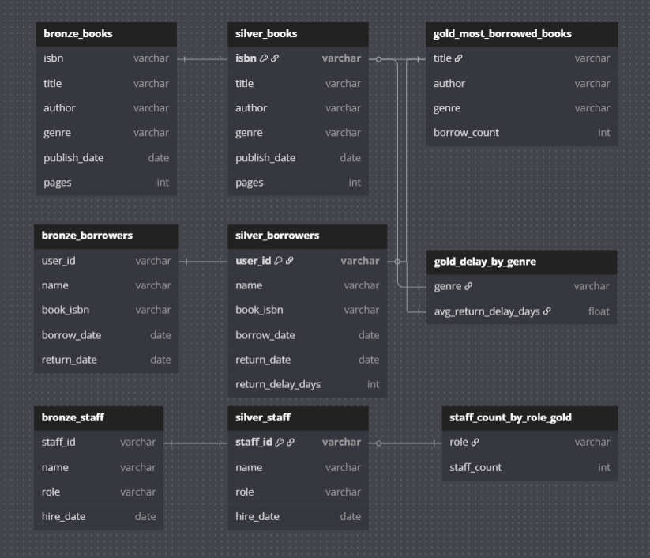

# FIRST STEPS WITH DATABRICKS: FROM ZERO TO LAKEHOUSE 

Welcome to the hands-on workshop for learning **Databricks Lakehouse Architecture** using the analogy of a **Library System**. This end-to-end demo showcases how to build scalable data pipelines using Bronze, Silver, and Gold layers to transform and prepare data for reliable analytics and reporting.

---

## Project Summary

This project simulates a public library managing:
- Books
- Borrowers
- Library staff

It walks participants through:
1. **Raw data ingestion (Bronze)**
2. **Data cleaning & enrichment (Silver)**
3. **Analytics (Gold)**
4. **Insights (Visualization Dashboard)**

---

## Dataset Overview

- `books.csv` — ~1,000 books with metadata
- `borrowers.csv` — ~10,000 borrowing records
- `staff.csv` — ~20 staff members

## How to Run the Project

> **Prerequisites**: Databricks Free Version or Enterprise Account Edition

### 1. Clone the repository onto your local

   - open your terminal and type the following code:
      git clone `https://github.com/Rashidomar/workshop_demo_databricks.git`
      This will clone the project onto your local machine

### 2. Create Notebooks on Databricks account by following the below steps

   1. Navigate to user workspace on
       - From left menu, go to user workspace by:  
       - clicking  Workspace > Users > `username`@gmail.com, when you get here, create a folder called `workshop_demo_databricks`
   2. Notebook Creation
       To create notebook:
      - Click **Create** > **Notebook** 
      - `bronze_layer` should be the name of your first notebook.
      - Select **SQL** as the langauge for the notebook.
      - Click **Create**
        Copy and paste the content of the bronze_layer from the cloned repo on local machine in the **SQL_Notebook** folder.
   3. Repeat the same steps to create your `silver_layer` and `gold_layer` notebooks

## Gold-Level Outputs

| Table | Description |
|-------|-------------|
| `most_borrowed_books.gold` | Top borrowed books by count |
| `delay_by_genre.gold` | Avg delay days per genre |
| `staff_count_by_role_gold` | Total  number of staff per role|

### The Medallion Architecture

### The Data Model

### The Visualization Dashboard

---

## Workshop Learning Goals

✅ Understand the Databricks Lakehouse concept  
✅ Apply Medallion Architecture best practices  
✅ Build an end-to-end ETL   
✅ Learn Delta Lake, Spark SQL, PySpark in context  

---

## Built With

- Databricks free edition
- PySpark / Spark SQL
- Delta Lake
---

## License

This project is open for educational use under the MIT License.
---

## Acknowledgments

Special thanks to:
- TheDataLead AI
- All participants building the future with data
---

